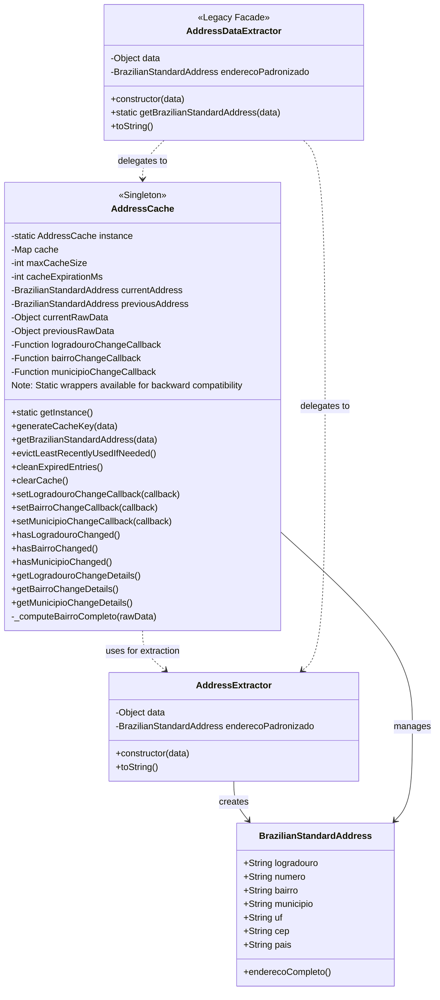
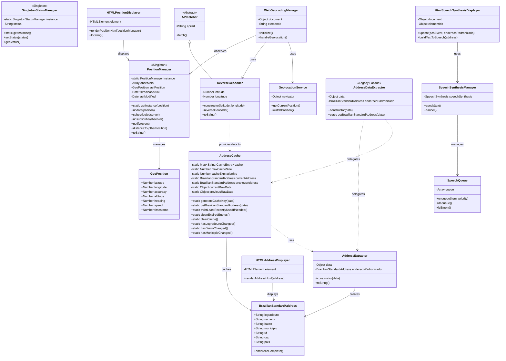

# Guia.js - Class Diagram Summary

This document provides a comprehensive overview of the Guia.js class architecture, with particular emphasis on the refactoring implemented in PR #121 that split the `AddressDataExtractor` class into specialized components following the Single Responsibility Principle.

## Overview

Guia.js is a geolocation web application (version 0.8.4-alpha) that provides geolocation services, address geocoding, and mapping integration for Brazilian addresses. The architecture follows object-oriented design patterns with clear separation of concerns.

## Architecture Layers

The application is organized into the following architectural layers:

### 1. Core Domain Layer
**Purpose**: Fundamental data structures and position management

- **GeoPosition**: Represents a geographic position with coordinates
- **PositionManager**: Singleton managing current position state (Observer pattern)
- **SingletonStatusManager**: Application-wide status management

### 2. Service Layer
**Purpose**: External API integrations and geocoding services

- **APIFetcher**: Base class for all API communications
- **ReverseGeocoder**: OpenStreetMap/Nominatim API integration for reverse geocoding
- **GeolocationService**: Browser Geolocation API wrapper
- **WebGeocodingManager**: Main coordination class for geocoding workflow

### 3. Data Processing Layer
**Purpose**: Address data extraction, validation, and caching

This layer underwent significant refactoring in PR #121 to improve cohesion and maintainability.

#### 3.1 Address Extraction (Refactored in PR #121)



#### 3.2 Responsibilities

**AddressExtractor** (New in PR #121)
- **Single Responsibility**: Extract and standardize address data from geocoding API responses
- Parses raw geocoding API response data (OpenStreetMap/Nominatim format)
- Maps API fields to Brazilian address standard fields (logradouro, bairro, municipio, uf, cep)
- Handles fallback values for missing or incomplete data
- Creates immutable `BrazilianStandardAddress` instances
- **No caching or change detection logic**

**AddressCache** (New in PR #121, Refactored to Singleton in PR #TBD)
- **Single Responsibility**: Manage caching of standardized addresses with LRU eviction and change detection
- **Singleton Pattern**: Ensures only one cache instance exists per application (refactored from static-only class)
- Access via `AddressCache.getInstance()` for instance methods
- Static wrappers available for backward compatibility
- Generates unique cache keys from address components
- Implements LRU (Least Recently Used) eviction policy (removes 25% when at max capacity of 50)
- Cleans expired entries (5-minute TTL)
- Tracks address changes (current vs. previous)
- Notifies registered callbacks when address components change (logradouro, bairro, municipio)
- Stores raw geocoding data alongside standardized addresses for detailed change information
- **No extraction logic**

**AddressDataExtractor** (Legacy Facade)
- **Single Responsibility**: Maintain backward compatibility
- Delegates all operations to `AddressExtractor` and `AddressCache`
- Preserves original API surface for existing code
- Uses property descriptors to keep static properties synchronized
- **Deprecated**: New code should use `AddressCache.getBrazilianStandardAddress()` directly

**BrazilianStandardAddress**
- Immutable data structure representing standardized Brazilian address
- Provides formatted output via `enderecoCompleto()` method
- Fields: logradouro, numero, bairro, municipio, uf, cep, pais

### 4. Presentation Layer
**Purpose**: HTML rendering and user interface

- **HTMLPositionDisplayer**: Coordinate display and Google Maps integration
- **HTMLAddressDisplayer**: Address formatting and presentation
- **HtmlSpeechSynthesisDisplayer**: Text-to-speech functionality
- **SpeechSynthesisManager**: Speech synthesis coordination
- **SpeechQueue**: Queue management for speech requests

## Complete Class Diagram



## Design Patterns Used

### Singleton Pattern
- **PositionManager**: Ensures single source of truth for current position
- **SingletonStatusManager**: Centralized application status management

### Observer Pattern
- **PositionManager**: Notifies subscribers of position updates
- Enables loose coupling between position updates and dependent components

### Facade Pattern
- **AddressDataExtractor**: Legacy facade maintaining backward compatibility
- **WebGeocodingManager**: Simplifies complex geocoding workflow

### Strategy Pattern
- **APIFetcher**: Base class allowing different API implementations
- **ReverseGeocoder**: Concrete strategy for OpenStreetMap/Nominatim

## Refactoring Summary (PR #121)

### Problem Addressed
The original `AddressDataExtractor` class suffered from low cohesion, mixing two distinct responsibilities:
1. Extracting and standardizing address data from API responses
2. Managing cache with LRU eviction, expiration, and change detection

### Solution Implemented
Split into two specialized classes with single, clear responsibilities:

**Before (0.8.3-alpha)**:
```
AddressDataExtractor (554 lines)
├── Extraction logic
├── Caching logic
├── LRU eviction
├── Change detection
└── Callback management
```

**After (0.8.4-alpha)**:
```
AddressExtractor (91 lines)
└── Extraction & standardization only

AddressCache (476 lines)
├── Cache key generation
├── LRU eviction policy
├── Expiration management
├── Change detection
└── Callback notifications

AddressDataExtractor (176 lines)
└── Legacy facade for compatibility
```

### Benefits Achieved

1. **Improved Cohesion**: Each class has a single, well-defined responsibility
2. **Better Maintainability**: Clear separation makes code easier to understand and modify
3. **Enhanced Documentation**: 200+ lines of comprehensive JSDoc comments added
4. **Easier Testing**: Each concern can be tested independently (34 tests passing)
5. **Better Extensibility**: New features can be added without affecting other concerns
6. **No Breaking Changes**: Legacy facade maintains full backward compatibility

### Test Results
- ✅ AddressDataExtractor.test.js: 9/9
- ✅ BairroChangeDetection.test.js: 11/11
- ✅ MunicipioChangeDetection.test.js: 10/10
- ✅ WebGeocodingManagerMunicipio.test.js: 4/4

## API Integration Points

### OpenStreetMap Nominatim
- **Endpoint**: `https://nominatim.openstreetmap.org/reverse`
- **Purpose**: Reverse geocoding (coordinates → address)
- **Handler**: `ReverseGeocoder` class

### IBGE API
- **Endpoint**: `https://servicodados.ibge.gov.br/api/v1/localidades/estados/`
- **Purpose**: Brazilian state/municipality data
- **Handler**: `guia_ibge.js` module

### Google Maps
- **Purpose**: Map viewing and Street View integration
- **Handler**: `HTMLPositionDisplayer` class

## Usage Examples

### Using the New Architecture (Recommended)

```javascript
// Extract address from geocoding data
const extractor = new AddressExtractor(geocodingData);
const standardizedAddress = extractor.enderecoPadronizado;

// Get cached address with change detection (using singleton)
// Option 1: Use static wrapper (backward compatible)
const address = AddressCache.getBrazilianStandardAddress(geocodingData);

// Option 2: Use singleton instance directly (preferred for new code)
const cache = AddressCache.getInstance();
const address2 = cache.getBrazilianStandardAddress(geocodingData);

// Register change callbacks
// Using static wrappers (backward compatible)
AddressCache.setBairroChangeCallback((details) => {
  console.log(`Neighborhood changed from ${details.previous.bairro} to ${details.current.bairro}`);
  console.log(`Complete neighborhood: ${details.current.bairroCompleto}`);
});

AddressCache.setMunicipioChangeCallback((details) => {
  console.log(`Municipality changed: ${details.current.municipio}, ${details.current.uf}`);
});

// Or use singleton instance directly
cache.setBairroChangeCallback((details) => {
  console.log('Bairro changed:', details);
});
```

### Using Legacy API (Compatibility)

```javascript
// Still works for existing code
const extractor = new AddressDataExtractor(geocodingData);
const address = extractor.enderecoPadronizado;

// Static methods delegated to AddressCache
const cachedAddress = AddressDataExtractor.getBrazilianStandardAddress(geocodingData);
AddressDataExtractor.setBairroChangeCallback(callback);
```

## Best Practices

### For New Development
1. Access AddressCache via `AddressCache.getInstance()` for instance methods (preferred)
2. Static wrappers like `AddressCache.getBrazilianStandardAddress()` available for convenience
3. Use `AddressExtractor` directly only when caching is not needed
4. Register change callbacks on `AddressCache` for monitoring address changes
5. Avoid using `AddressDataExtractor` (legacy facade) in new code

### For Maintenance
1. `AddressCache` uses singleton pattern - only one instance exists per application
2. All static properties on `AddressDataExtractor` are synchronized with `AddressCache` singleton
3. Change detection uses signature tracking to prevent notification loops
4. Cache implements LRU eviction (25% removal when at 50-entry capacity)
5. Cache entries expire after 5 minutes (300,000 ms)
6. Static methods/properties delegate to singleton instance for backward compatibility

### For Testing
1. Use `AddressCache.clearCache()` to reset state between tests (works on singleton)
2. Test extraction and caching concerns independently
3. Mock raw geocoding data with realistic OpenStreetMap format
4. Verify callback invocations for change detection
5. Multiple `getInstance()` calls return the same instance (testable singleton behavior)

## File Organization

```
guia_js/
├── src/
│   ├── guia.js (4,196 lines)
│   │   ├── Core Domain (lines 1-666)
│   │   ├── Service Layer (lines 667-1617)
│   │   ├── Data Processing (lines 1618-2441)
│   │   │   ├── AddressExtractor (lines 1618-1703)
│   │   │   ├── AddressCache (lines 1705-2268)
│   │   │   └── AddressDataExtractor (lines 2270-2441)
│   │   └── Presentation Layer (lines 2442-4196)
│   └── guia_ibge.js (10 lines)
├── __tests__/ (5 test suites, 55 tests)
├── docs/
│   └── CLASS_DIAGRAM.md (this file)
├── TESTING.md
├── DEVICE_DETECTION.md
├── VOICE_SELECTION.md
└── package.json
```

## Version History

- **0.8.4-alpha** (Current): Refactored address extraction architecture (PR #121)
- **0.8.3-alpha**: Original unified AddressDataExtractor implementation
- **0.8.2-alpha**: Address change detection features
- **0.8.1-alpha**: Brazilian address standardization
- **0.8.0-alpha**: Core geocoding functionality

## References

- Pull Request #121: "Refactor AddressDataExtractor into cohesive AddressExtractor and AddressCache classes"
- OpenStreetMap Nominatim API: https://nominatim.openstreetmap.org/
- IBGE API Documentation: https://servicodados.ibge.gov.br/api/docs
- Haversine Formula: https://en.wikipedia.org/wiki/Haversine_formula

## Author

Marcelo Pereira Barbosa

## License

See repository root for license information.
