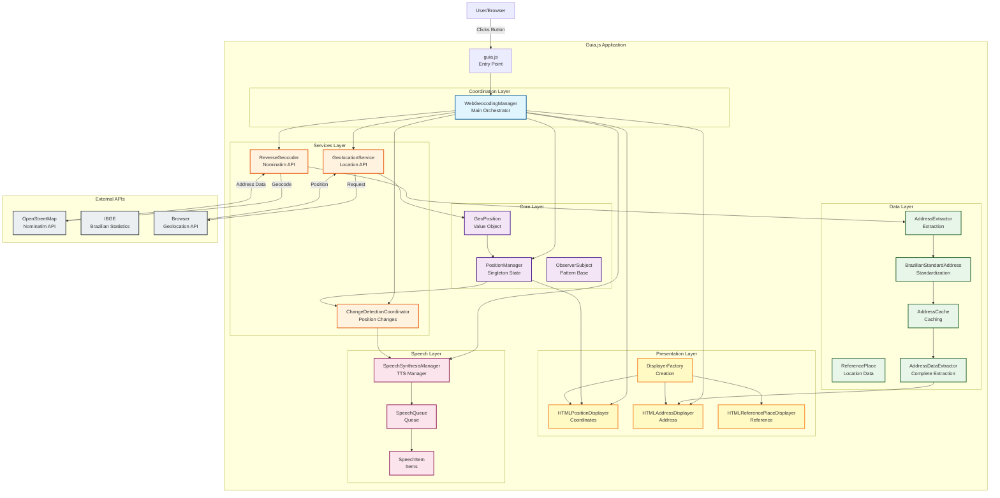
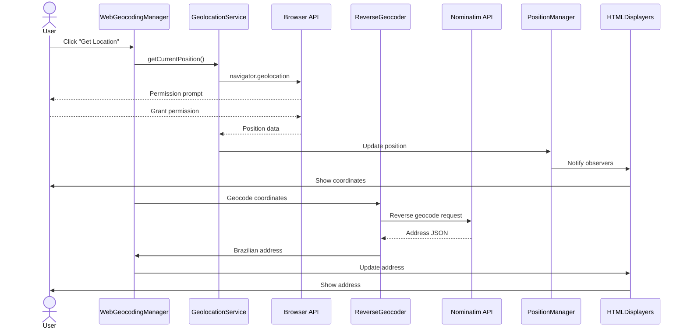
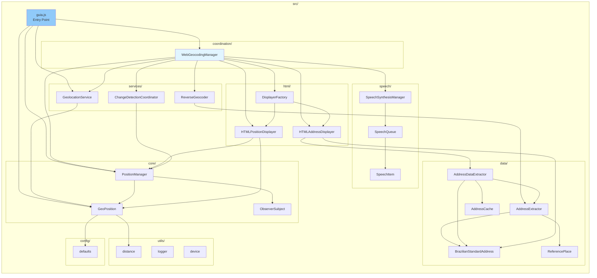
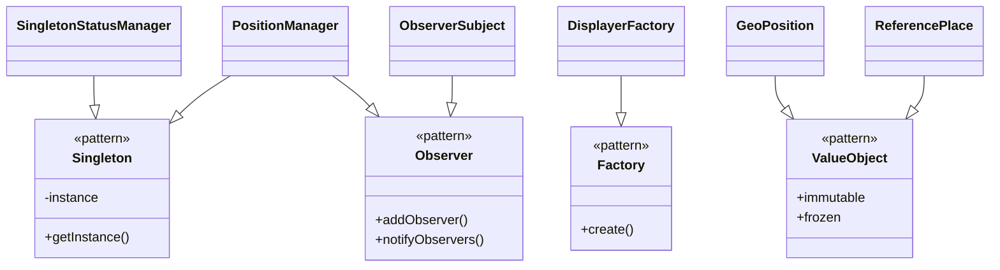
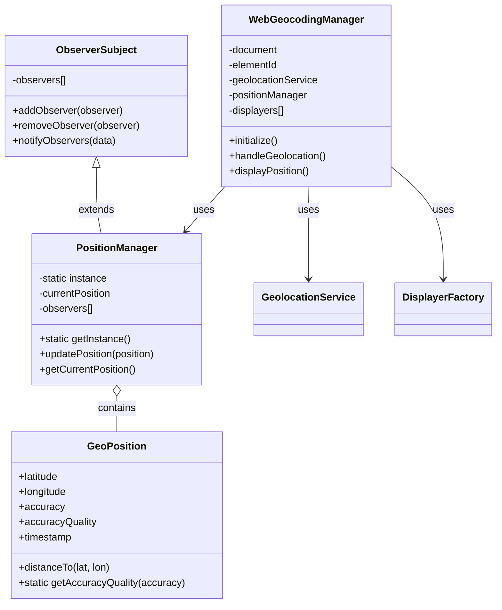
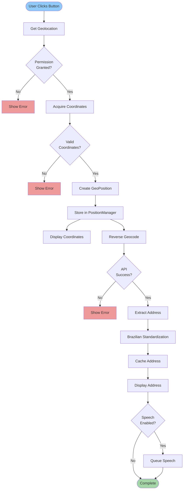
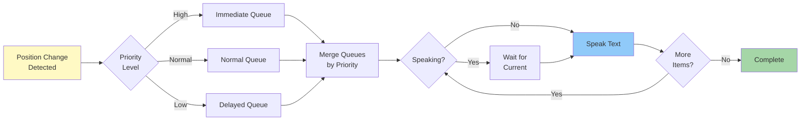

# Documentation Improvement Recommendations

**Date**: 2026-01-01  
**Version**: 0.6.0-alpha

## Overview

This document provides actionable recommendations to further improve Guia.js documentation quality, maintainability, and usability.

## 1. "Last Updated" Dates - Prevent Documentation Staleness

### Current Status
- ✅ **24 of 59** markdown files have "Last Updated" dates (41% coverage)
- ✅ Key files updated: README.md, CONTRIBUTING.md, INDEX.md, new testing guides
- ⚠️ **35 files** still lack timestamps

### Recommended Action: Add Footer Template

Create a standard footer template for all documentation files:

```markdown
---

**Version**: 0.6.0-alpha  
**Status**: Active Development  
**Last Updated**: 2026-01-01  
**Related**: [Link to related docs]
```

### Priority Files Needing Timestamps

**High Priority** (Core Documentation):
```bash
# Add timestamps to these first
docs/MODULES.md
docs/MODULE_SPLITTING_GUIDE.md
docs/architecture/CLASS_DIAGRAM.md
docs/architecture/POSITION_MANAGER.md
docs/architecture/WEB_GEOCODING_MANAGER.md
.github/JAVASCRIPT_BEST_PRACTICES.md
.github/REFERENTIAL_TRANSPARENCY.md
.github/CODE_REVIEW_GUIDE.md
```

**Medium Priority** (Feature Documentation):
```bash
docs/DEVICE_DETECTION.md
docs/VOICE_SELECTION.md
docs/IBIRA_INTEGRATION.md
docs/api-integration/NOMINATIM_INTEGRATION.md
```

**Low Priority** (Historical/Archive):
```bash
docs/class-extraction/*.md (already mostly dated)
docs/issue-189/*.md (already dated)
```

### Automation Recommendation

Create a git pre-commit hook to update "Last Updated" automatically:

```bash
#!/bin/bash
# .git/hooks/pre-commit

# Update "Last Updated" date in modified .md files
for file in $(git diff --cached --name-only --diff-filter=ACM | grep '\.md$'); do
    if grep -q "Last Updated:" "$file"; then
        # Update existing date
        sed -i "s/Last Updated: .*/Last Updated: $(date +%Y-%m-%d)/" "$file"
        git add "$file"
    fi
done
```

### Benefits
- ✅ Easy to identify stale documentation
- ✅ Prioritize review of old documents
- ✅ Build trust with contributors (shows maintenance)
- ✅ Automated with git hooks

---

## 2. Migration Guides for Breaking Changes

### Current Status
- ✅ **CLASS_LOCATION_GUIDE.md** created (addresses modularization navigation)
- ⚠️ Missing: Step-by-step migration guides for actual code changes

### Recommended: Create Migration Guide Series

#### A. MIGRATION_GUIDE_MODULARIZATION.md

```markdown
# Migrating to Modularized Guia.js (0.6.0-alpha)

## Breaking Changes

### 1. Module System (ES6)

**Before (0.5.x)**:
```html
<script src="guia.js"></script>
<script>
  const manager = new WebGeocodingManager(document, 'container');
</script>
```

**After (0.6.0)**:
```html
<script type="module">
  import { WebGeocodingManager } from './src/guia.js';
  const manager = new WebGeocodingManager(document, 'container');
</script>
```

### 2. File Paths Changed

**Before**: `guia.js` (monolithic file)  
**After**: `src/guia.js` (entry point) + 28 module files

### 3. Import Paths

**Before**: All classes in one file  
**After**: 
```javascript
import { GeoPosition } from './src/core/GeoPosition.js';
import { PositionManager } from './src/core/PositionManager.js';
import { GeolocationService } from './src/services/GeolocationService.js';
```

## Migration Steps

### Step 1: Update HTML Script Tags
Add `type="module"` to all script tags loading Guia.js

### Step 2: Update Import Paths
Change all `guia.js` references to `src/guia.js`

### Step 3: Update CDN URLs
Use new modular CDN structure:
```
https://cdn.jsdelivr.net/gh/mpbarbosa/guia_js@0.6.0-alpha/src/guia.js
```

### Step 4: Test Thoroughly
Run full test suite: `npm run test:all`

## Compatibility

**Browser Support**: Chrome 90+, Firefox 88+, Safari 14+, Edge 90+  
**Node.js Support**: v18+ (ES6 modules)

## Rollback Plan

If issues arise, pin to previous version:
```html
<script src="https://cdn.jsdelivr.net/gh/mpbarbosa/guia_js@0.5.0/guia.js"></script>
```
```

#### B. MIGRATION_GUIDE_API_CHANGES.md

Document any API changes between versions:
```markdown
# API Changes and Deprecations

## Version 0.6.0-alpha

### Deprecated Methods

**GeoPosition.calculateAccuracyQuality()** (line 97)  
- **Status**: Deprecated, has bug
- **Replacement**: Use `position.accuracyQuality` property
- **Removal**: Planned for 0.7.0

### Renamed Classes

**CurrentPosition** → **PositionManager**  
**APIFetcher** → No longer exported (internal only)

### New Features

**Speech Queue Priority System**  
**Address Caching**  
**Brazilian Address Standardization**
```

#### C. MIGRATION_GUIDE_TESTING.md

Help developers migrate tests:
```markdown
# Migrating Tests to ES6 Modules

## Jest Configuration Changes

**Before (0.5.x)**:
```json
{
  "testEnvironment": "jsdom"
}
```

**After (0.6.0)**:
```json
{
  "testEnvironment": "node",
  "transform": {}
}
```

## Import Changes

**Before**:
```javascript
const { GeoPosition } = require('./guia.js');
```

**After**:
```javascript
import { GeoPosition } from '../src/core/GeoPosition.js';
```

## Running Tests

**Before**: `npm test`  
**After**: `node --experimental-vm-modules node_modules/jest/bin/jest.js`
```

### Implementation Plan

1. **Create docs/migration/** directory
2. **Add 3 migration guides** (modularization, API, testing)
3. **Link from README.md** "Upgrading" section
4. **Link from INDEX.md** "Migration Guides" section
5. **Add to release notes** for version announcements

### Benefits
- ✅ Reduces upgrade friction
- ✅ Prevents breaking user code
- ✅ Shows commitment to backwards compatibility
- ✅ Helps onboard existing users

---

## 3. Visual Diagrams - Architecture Visualization

### Current Status
- ⚠️ All architecture documentation is text-only
- ⚠️ CLASS_DIAGRAM.md is descriptive text, not visual
- ⚠️ Difficult to grasp system architecture quickly

### Recommended: Add Mermaid Diagrams

GitHub natively supports Mermaid.js diagrams in markdown. No additional tools needed.

#### A. System Architecture Diagram

Add to `docs/architecture/SYSTEM_ARCHITECTURE.md`:

```markdown
# System Architecture - Visual Overview

## High-Level Architecture



## Data Flow: Geolocation Workflow



## Module Dependencies


```

#### B. Class Relationship Diagram

Add to `docs/architecture/CLASS_RELATIONSHIPS.md`:

```markdown
# Class Relationships and Patterns

## Design Patterns Used



## Core Class Hierarchy


```

#### C. Data Flow Diagrams

Add to `docs/architecture/DATA_FLOW.md`:

```markdown
# Data Flow Diagrams

## Address Processing Pipeline



## Speech Synthesis Flow


```

### Implementation Steps

1. **Create new architecture docs** with Mermaid diagrams:
   - `docs/architecture/SYSTEM_ARCHITECTURE.md`
   - `docs/architecture/CLASS_RELATIONSHIPS.md`
   - `docs/architecture/DATA_FLOW.md`

2. **Update existing CLASS_DIAGRAM.md**:
   - Keep text descriptions
   - Add Mermaid diagrams
   - Link to new visual docs

3. **Add to INDEX.md** under Architecture section

4. **Update README.md**:
   - Add "Architecture" section with diagram preview
   - Link to full architecture docs

### Benefits
- ✅ Quick visual understanding of system
- ✅ Easier onboarding for new contributors
- ✅ Better communication of design decisions
- ✅ No external tools needed (GitHub native)
- ✅ Version controlled (text-based)
- ✅ Easy to update alongside code

---

## Implementation Priority

### Phase 1: Quick Wins (1-2 hours)
1. ✅ Add timestamps to 10 high-priority docs
2. ✅ Create 1 basic system architecture diagram
3. ✅ Create migration guide outline

### Phase 2: Core Documentation (4-6 hours)
1. Add timestamps to all remaining docs
2. Create 3 comprehensive migration guides
3. Add 3 Mermaid diagrams (system, class, data flow)

### Phase 3: Automation (2-3 hours)
1. Set up git pre-commit hook for timestamps
2. Create CI check for missing timestamps
3. Add diagram generation to build process

### Phase 4: Enhancement (ongoing)
1. Add more detailed diagrams as needed
2. Update migration guides for each version
3. Review and update timestamps quarterly

---

## Success Metrics

### Documentation Quality
- **Target**: 100% of docs have timestamps
- **Target**: Zero broken internal links
- **Target**: All breaking changes documented

### User Experience
- **Target**: < 5 minutes to understand architecture (with diagrams)
- **Target**: < 30 minutes to complete migration
- **Target**: Positive contributor feedback on clarity

### Maintenance
- **Target**: Automated timestamp updates
- **Target**: Diagrams updated with code changes
- **Target**: Migration guides for each release

---

## Conclusion

These three improvements will significantly enhance Guia.js documentation:

1. **Timestamps**: Prevent staleness, build trust
2. **Migration Guides**: Reduce upgrade friction, retain users
3. **Visual Diagrams**: Improve comprehension, faster onboarding

All improvements leverage existing tools (Mermaid, git hooks) and align with current documentation practices.

---

**Version**: 0.6.0-alpha  
**Last Updated**: 2026-01-01  
**Priority**: Phase 1 recommended for immediate implementation
