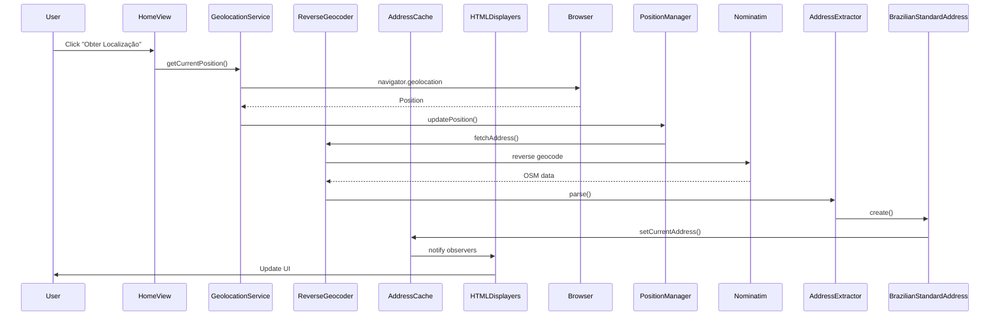
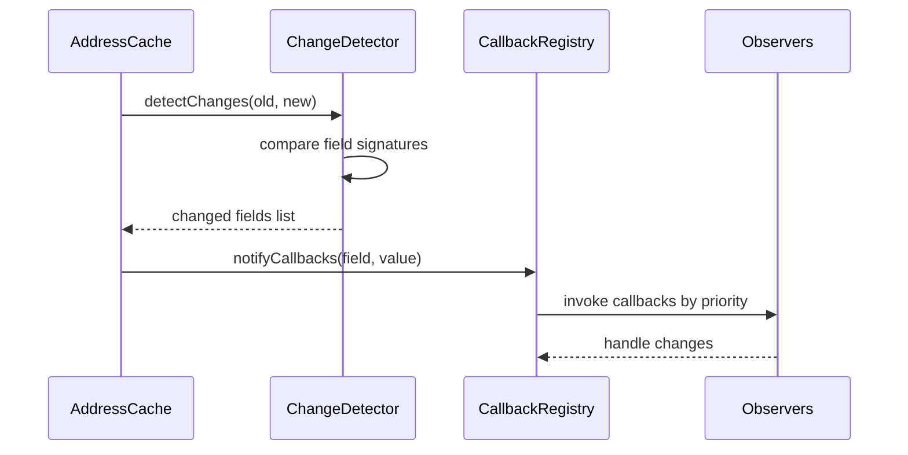
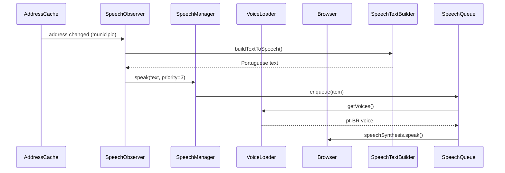

# Architecture Guide - Guia Turístico

---

**Last Updated**: 2026-02-17
**Version**: 0.11.0-alpha
**Status**: Active
**Category**: Architecture
---

**Navigation**: [🏠 Documentation Hub](../README.md) | [📖 Complete Index](../INDEX.md) | [🎯 Quick Start](../guides/GETTING_STARTED.md)

---

## Table of Contents

1. [System Overview](#system-overview)
2. [Architecture Layers](#architecture-layers)
3. [Core Components](#core-components)
4. [Data Flow](#data-flow)
5. [Design Patterns](#design-patterns)
6. [Extension Points](#extension-points)
7. [Technology Stack](#technology-stack)

---

## System Overview

Guia Turístico is a **Single-Page Application (SPA)** tourist guide built on top of the **guia.js** geolocation library. The application provides real-time location tracking with Brazilian address geocoding, speech synthesis, and IBGE demographic data integration.

### Key Features

- **Real-time geolocation** tracking with browser Geolocation API
- **Brazilian address standardization** via OpenStreetMap Nominatim
- **IBGE integration** for demographic statistics (SIDRA API)
- **Speech synthesis** with Brazilian Portuguese voice prioritization
- **Responsive UI** with highlight cards for municipality and neighborhood
- **Single-page routing** for location tracking and coordinate conversion

### Architecture Principles

1. **Separation of Concerns**: Clear boundaries between data, business logic, and presentation
2. **Observer Pattern**: Event-driven communication between components
3. **Composition over Inheritance**: Modular components with focused responsibilities
4. **Immutability**: Functional programming principles for predictable state
5. **Dependency Injection**: Testability through constructor injection

---

## Architecture Layers

The application follows a **layered architecture** with clear separation of concerns:

```
┌─────────────────────────────────────────────────────────┐
│                    Presentation Layer                    │
│  (Views, HTML Displayers, UI Components)                │
├─────────────────────────────────────────────────────────┤
│                   Coordination Layer                     │
│  (WebGeocodingManager, Service Coordinators)            │
├─────────────────────────────────────────────────────────┤
│                     Service Layer                        │
│  (GeolocationService, ReverseGeocoder)                  │
├─────────────────────────────────────────────────────────┤
│                      Data Layer                          │
│  (Address Models, Caching, State Management)            │
├─────────────────────────────────────────────────────────┤
│                       Core Layer                         │
│  (GeoPosition, PositionManager, ObserverSubject)        │
└─────────────────────────────────────────────────────────┘
```

### Layer Responsibilities

#### 1. **Core Layer** (`src/core/`)

**Purpose**: Foundation classes and state management

- **GeoPosition**: Immutable value object for geographic coordinates
- **PositionManager**: Singleton for current position state
- **GeocodingState**: Application state tracking
- **ObserverSubject**: Observer pattern implementation

**Key Principle**: Immutability and state isolation

#### 2. **Data Layer** (`src/data/`)

**Purpose**: Data models, parsing, and caching

- **BrazilianStandardAddress**: Address standardization for Brazilian locations
- **AddressExtractor**: Nominatim data parsing
- **AddressCache**: LRU caching with change detection
- **ReferencePlace**: Point of interest data model

**Key Principle**: Data transformation and validation

#### 3. **Service Layer** (`src/services/`)

**Purpose**: External API integration and business logic

- **GeolocationService**: Browser Geolocation API wrapper
- **ReverseGeocoder**: OpenStreetMap Nominatim integration
- **ChangeDetectionCoordinator**: Address change tracking

**Key Principle**: API abstraction and error handling

#### 4. **Coordination Layer** (`src/coordination/`)

**Purpose**: Orchestrate services and manage workflows

- **WebGeocodingManager**: Main application coordinator
- **ServiceCoordinator**: Service lifecycle management
- **EventCoordinator**: Event dispatching
- **UICoordinator**: UI update coordination
- **SpeechCoordinator**: Speech synthesis workflow

**Key Principle**: Workflow orchestration and service integration

#### 5. **Presentation Layer** (`src/html/`, `src/views/`)

**Purpose**: UI rendering and user interaction

- **View Controllers** (`HomeViewController`, `ConverterViewController`): SPA views
- **HTML Displayers**: Component-specific rendering
- **UI Components**: Toast notifications, empty states, skeletons

**Key Principle**: Declarative UI and separation from business logic

---

## Core Components

### Position Management

```javascript
// Core position flow
GeoPosition (immutable)
    → PositionManager (singleton state)
    → GeolocationService (browser API)
    → ReverseGeocoder (address lookup)
    → AddressCache (caching + change detection)
```

#### GeoPosition

**Source**: [`paraty_geocore.js`](https://github.com/mpbarbosa/paraty_geocore.js) (external library, `v0.11.0`)
**CDN URL**: `https://cdn.jsdelivr.net/gh/mpbarbosa/paraty_geocore.js@0.11.0/dist/esm/index.js`
**Purpose**: Immutable geographic coordinate container

> ⚠️ `src/core/GeoPosition.ts` was removed in `v0.12.4-alpha`. `GeoPosition` is now imported directly from the `paraty_geocore.js` CDN (ESM build).

**Import**:

```ts
import { GeoPosition } from 'https://cdn.jsdelivr.net/gh/mpbarbosa/paraty_geocore.js@0.11.0/dist/esm/index.js';
```

**Key Methods**:

- `constructor(latitude, longitude, accuracy, timestamp)` - Create position
- `toJSON()` - Serialize to JSON
- `equals(otherPosition)` - Value equality check

**Design**: Value object pattern, immutable state

#### PositionManager

**File**: `src/core/PositionManager.js`
**Purpose**: Centralized position state management

**Key Methods**:

- `static getInstance()` - Get singleton instance
- `getCurrentPosition()` - Retrieve current position
- `updatePosition(geoPosition)` - Update position with thresholds
- `hasPosition()` - Check if position exists

**Update Thresholds**:

- **Distance**: 20 meters minimum change
- **Time**: 30 seconds minimum interval

### Address Processing

```javascript
// Address data flow
Nominatim API Response
    → AddressExtractor (parse OSM data)
    → BrazilianStandardAddress (standardize)
    → AddressCache (store + detect changes)
    → HTMLAddressDisplayer (render)
```

#### BrazilianStandardAddress

**File**: `src/data/BrazilianStandardAddress.js`
**Purpose**: Brazilian address standardization

**Key Properties**:

- `municipio`, `bairro`, `logradouro` - Address components
- `estado`, `regiaoMetropolitana` - Administrative divisions
- `cep`, `numero` - Postal code and street number

**Key Methods**:

- `municipioCompleto()` - Municipality with state (e.g., "Recife, PE")
- `regiaoMetropolitanaFormatada()` - Formatted metropolitan region

#### AddressCache

**File**: `src/data/AddressCache.js`
**Purpose**: Address caching with change detection

**Architecture**: Composition pattern with 3 components:

- `AddressDataStore` - Data storage with history
- `AddressChangeDetector` - Change detection by field
- `CallbackRegistry` - Callback management with error handling

**Key Methods**:

- `setCurrentAddress(address)` - Update current address
- `getCurrentAddress()` - Retrieve current address
- `registerCallback(fieldName, callback, priority)` - Subscribe to changes

### Service Coordination

```javascript
// Main coordination workflow
WebGeocodingManager (main coordinator)
    ├── ServiceCoordinator (lifecycle)
    ├── EventCoordinator (events)
    ├── UICoordinator (UI updates)
    └── SpeechCoordinator (speech synthesis)
```

#### WebGeocodingManager

**File**: `src/coordination/WebGeocodingManager.js`
**Purpose**: Main application coordinator

**Key Responsibilities**:

- Initialize all services and displayers
- Coordinate geolocation workflows
- Manage event subscriptions
- Handle errors and state transitions

**Key Methods**:

- `async init()` - Initialize all coordinators
- `getSingleLocationUpdate()` - One-time position capture
- `startTracking()` - Continuous tracking
- `stopTracking()` - Stop tracking

### Speech Synthesis

```javascript
// Speech synthesis architecture
SpeechSynthesisManager (main orchestrator)
    ├── VoiceLoader (async voice loading)
    ├── VoiceSelector (pt-BR prioritization)
    ├── SpeechConfiguration (rate/pitch)
    └── SpeechQueue (priority queue)
```

#### SpeechSynthesisManager

**File**: `src/speech/SpeechSynthesisManager.js`
**Purpose**: Speech synthesis orchestration using composition

**Composition Pattern**: 4 focused components

- **VoiceLoader**: Exponential backoff retry for voice loading
- **VoiceSelector**: Brazilian Portuguese voice prioritization
- **SpeechConfiguration**: Parameter validation (rate, pitch)
- **SpeechQueue**: Priority-based request queuing

**Priority Levels**:

1. Municipality change (priority 3)
2. Neighborhood change (priority 2)
3. Street change (priority 1)
4. Periodic announcements (priority 0)

---

## Data Flow

### Geolocation Workflow



### Address Change Detection



### Speech Synthesis Workflow



---

## Design Patterns

### 1. **Observer Pattern**

**Used in**: AddressCache, PositionManager, EventCoordinator

**Purpose**: Decoupled event notification

**Example**:

```javascript
// AddressCache notifies observers of address changes
addressCache.registerCallback('municipio', (newValue) => {
  console.log(`Municipality changed to: ${newValue}`);
}, priority: 3);
```

**Benefits**:

- Loose coupling between components
- Multiple subscribers per event
- Priority-based execution

### 2. **Singleton Pattern**

**Used in**: PositionManager, SingletonStatusManager, TimerManager

**Purpose**: Single instance for global state

**Example**:

```javascript
const positionManager = PositionManager.getInstance();
const currentPosition = positionManager.getCurrentPosition();
```

**Benefits**:

- Centralized state management
- Consistent state across application
- Controlled access point

### 3. **Factory Pattern**

**Used in**: DisplayerFactory

**Purpose**: Centralized object creation

**Example**:

```javascript
const displayer = DisplayerFactory.createPositionDisplayer(document);
displayer.displayPosition(geoPosition);
```

**Benefits**:

- Encapsulated instantiation logic
- Consistent object creation
- Easy to extend with new types

### 4. **Composition Pattern**

**Used in**: SpeechSynthesisManager, AddressCache, HtmlSpeechSynthesisDisplayer

**Purpose**: Build complex objects from simpler components

**Example**:

```javascript
class SpeechSynthesisManager {
  constructor() {
    this.voiceLoader = new VoiceLoader();
    this.voiceSelector = new VoiceSelector();
    this.configuration = new SpeechConfiguration();
    this.queue = new SpeechQueue();
  }
}
```

**Benefits**:

- Single Responsibility Principle
- Better testability
- Flexible component reuse

### 5. **Value Object Pattern**

**Used in**: GeoPosition, BrazilianStandardAddress

**Purpose**: Immutable data containers

**Example**:

```javascript
const position = new GeoPosition(lat, lon, accuracy, timestamp);
// position is immutable - cannot be modified after creation
```

**Benefits**:

- Predictable state
- Thread-safe (in concurrent scenarios)
- Easier to reason about

### 6. **Facade Pattern**

**Used in**: HtmlSpeechSynthesisDisplayer (v0.11.0-alpha)

**Purpose**: Simplified interface to complex subsystems

**Example**:

```javascript
class HtmlSpeechSynthesisDisplayer {
  constructor() {
    this.controls = new HtmlSpeechControls();
    this.observer = new AddressSpeechObserver();
    this.textBuilder = new SpeechTextBuilder();
  }

  // Simple interface hiding complex composition
  async init() {
    await this.controls.init();
    this.observer.init(this.textBuilder);
  }
}
```

**Benefits**:

- Reduced complexity for clients
- Backward compatibility (100% API preserved)
- Easier maintenance

---

## Extension Points

### Adding New View Controllers

**Location**: `src/views/`

**Template**:

```javascript
export class MyViewController {
  constructor(document, params = {}) {
    this.document = document;
    this.params = params;
  }

  async init() {
    // Initialize resources
  }

  destroy() {
    // Clean up resources
  }

  static async create(document, params) {
    const controller = new MyViewController(document, params);
    await controller.init();
    return controller;
  }
}
```

**Register in Router** (`src/app.js`):

```javascript
routes['/my-route'] = async () => {
  const controller = await MyViewController.create(document, params);
  // Attach to lifecycle
};
```

### Adding New Displayers

**Location**: `src/html/`

**Template**:

```javascript
export class HTMLMyDataDisplayer {
  constructor(document) {
    this.document = document;
    this.element = null;
  }

  initialize() {
    this.element = this.document.getElementById('my-data');
  }

  display(data) {
    if (!this.element) return;
    this.element.innerHTML = this.formatData(data);
  }

  formatData(data) {
    // Format logic
    return `<div>${data}</div>`;
  }
}
```

**Register in DisplayerFactory**:

```javascript
static createMyDataDisplayer(document) {
  const displayer = new HTMLMyDataDisplayer(document);
  displayer.initialize();
  return displayer;
}
```

### Adding New Services

**Location**: `src/services/`

**Template**:

```javascript
export class MyService {
  constructor() {
    this.baseUrl = 'https://api.example.com';
  }

  async fetchData(params) {
    try {
      const response = await fetch(`${this.baseUrl}/endpoint`, {
        method: 'GET',
        headers: { 'Content-Type': 'application/json' }
      });
      return await response.json();
    } catch (error) {
      console.error('MyService error:', error);
      throw error;
    }
  }
}
```

### Adding New Coordinators

**Location**: `src/coordination/`

**Template**:

```javascript
export class MyCoordinator {
  constructor(dependencies) {
    this.service = dependencies.service;
    this.displayer = dependencies.displayer;
  }

  async initialize() {
    // Setup coordination logic
  }

  async execute() {
    const data = await this.service.fetchData();
    this.displayer.display(data);
  }

  destroy() {
    // Clean up resources
  }
}
```

---

## Technology Stack

### Frontend

- **JavaScript**: ES2022 with ES modules
- **Build Tool**: Vite 7.3.1 (development server, HMR, code splitting)
- **Routing**: Hash-based SPA routing (`#/`, `#/converter`)
- **Styling**: Modular CSS (15 files: accessibility, typography, navigation, etc.)

### APIs & Data Sources

- **Geolocation**: Browser Geolocation API
- **Geocoding**: OpenStreetMap Nominatim (`nominatim.openstreetmap.org`)
- **Brazilian Data**: IBGE API (`servicodados.ibge.gov.br`)
- **Demographics**: SIDRA API (IBGE population estimates)
- **Maps**: Google Maps (view-only links, Street View)

### Testing

- **Test Framework**: Jest 30.1.3 with jsdom 25.0.1
- **E2E Testing**: Puppeteer 24.35.0 (headless Chrome)
- **Coverage**: ~85% overall (84.7% actual)
- **Test Suites**: 101 suites, 2,401 tests (2,235 passing)

### Development Tools

- **Version Control**: Git with Husky hooks (pre-commit, pre-push)
- **Linting**: ESLint 9 with flat configuration
- **Documentation**: JSDoc for API docs
- **CI/CD**: GitHub Actions (syntax validation, tests, security checks)

### Build & Deployment

- **Bundle Size**: 900 KB (25% reduction from 1.2M source)
- **Code Splitting**: 7 chunks (vendor, speech, core, services, data, html, coordination)
- **Minification**: Terser with source maps
- **Browser Support**: ES2022 (Chrome 94+, Firefox 93+, Safari 15+)
- **CDN**: jsDelivr for NPM package distribution

### Performance Optimizations

- **LRU Caching**: Address data caching with automatic eviction
- **Lazy Loading**: Code split by feature (speech, services, etc.)
- **Timer Management**: Centralized with leak prevention
- **HMR**: Hot Module Replacement in development (Vite)

---

## Related Documentation

- **[Getting Started Guide](../guides/GETTING_STARTED.md)** - Setup and first steps
- **[API Reference](../api/API_REFERENCE.md)** - Complete API documentation
- **[Developer Guide](../developer/DEVELOPER_GUIDE.md)** - Development workflows
- **[Testing Guide](../testing/TEST_STRATEGY.md)** - Testing philosophy
- **[Views Layer](./VIEWS_LAYER.md)** - View controllers in detail
- **[System Overview](./SYSTEM_OVERVIEW.md)** - High-level architecture

---

**Last Updated**: 2026-02-17
**Architecture Version**: 0.11.0-alpha
**Documentation Status**: ✅ Complete
