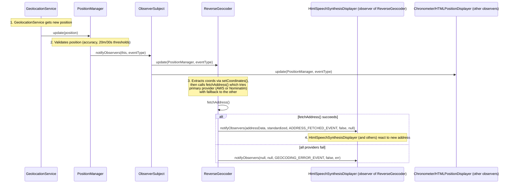
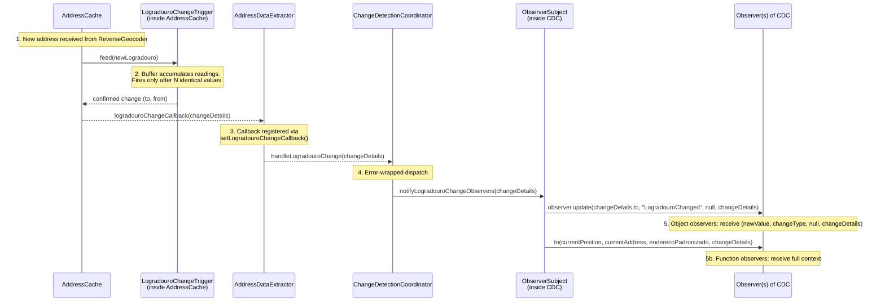

# Observer Pattern Execution Flow

This document describes the execution flow of the Observer pattern as implemented in the TypeScript source files under `src/`, focusing on the position update process and advanced callback-observer combinations.

## Key Components

- **Subject:** `PositionManager` (re-exported from `paraty_geocore.js`; wraps `DualObserverSubject`)
- **Observers:** Any object with an `update()` method (e.g., `ReverseGeocoder`, `HTMLPositionDisplayer`, `Chronometer`, etc.)
- **Event:** Position update

---

## Sequence Diagram: Simple Position Update Flow

```mermaid
sequenceDiagram
    participant GeolocationService
    participant PositionManager
    participant ObserverSubject
    participant ReverseGeocoder
    participant ReverseGeocoderObs as HtmlSpeechSynthesisDisplayer (observer of ReverseGeocoder)
    participant Observer1 as Chronometer/HTMLPositionDisplayer (other observers)

    Note over GeolocationService: 1. GeolocationService gets new position
    GeolocationService->>PositionManager: update(position)
    Note over PositionManager: 2. Validates position (accuracy, 20m/30s thresholds)
    PositionManager->>ObserverSubject: notifyObservers(this, eventType)
    ObserverSubject->>ReverseGeocoder: update(PositionManager, eventType)
    ObserverSubject->>Observer1: update(PositionManager, eventType)
    Note over ReverseGeocoder: 3. Extracts coords via setCoordinates(),<br/>then calls fetchAddress() which tries<br/>primary provider (AWS or Nominatim)<br/>with fallback to the other
    ReverseGeocoder->>ReverseGeocoder: fetchAddress()
    alt fetchAddress() succeeds
        ReverseGeocoder->>ReverseGeocoderObs: notifyObservers(addressData, standardized, ADDRESS_FETCHED_EVENT, false, null)
        Note over ReverseGeocoderObs: 4. HtmlSpeechSynthesisDisplayer (and others) react to new address
    else all providers fail
        ReverseGeocoder->>ReverseGeocoderObs: notifyObservers(null, null, GEOCODING_ERROR_EVENT, false, err)
    end
```

---

## Combined Callback and Observer Pattern Execution Flow

This diagram illustrates how a change in logradouro (street) is detected and propagated using both a callback mechanism and the observer-subject pattern.

In v0.12.12-alpha, **confirmation buffers** were added to `AddressCache` to mitigate GPS intersection jitter: a field-change callback only fires after `N` consecutive identical readings (`LogradouroChangeTrigger` for logradouro; `AddressFieldConfirmationBuffer` for bairro/municipio). The `ChangeDetectionCoordinator` class now owns the observer-notification logic that was previously inlined in `WebGeocodingManager`.

```mermaid
sequenceDiagram
    participant AddressCache
    participant ConfirmBuffer as LogradouroChangeTrigger<br/>(inside AddressCache)
    participant AddressDataExtractor
    participant ChangeDetectionCoordinator
    participant ObserverSubject as ObserverSubject<br/>(inside CDC)
    participant ObserverX as Observer(s) of CDC

    Note over AddressCache: 1. New address received from ReverseGeocoder
    AddressCache->>ConfirmBuffer: feed(newLogradouro)
    Note over ConfirmBuffer: 2. Buffer accumulates readings.<br/>Fires only after N identical values.
    ConfirmBuffer-->>AddressCache: confirmed change (to, from)

    AddressCache-->>AddressDataExtractor: logradouroChangeCallback(changeDetails)
    Note over AddressDataExtractor: 3. Callback registered via<br/>setLogradouroChangeCallback()

    AddressDataExtractor-->>ChangeDetectionCoordinator: handleLogradouroChange(changeDetails)
    Note over ChangeDetectionCoordinator: 4. Error-wrapped dispatch
    ChangeDetectionCoordinator->>ObserverSubject: notifyLogradouroChangeObservers(changeDetails)

    ObserverSubject->>ObserverX: observer.update(changeDetails.to, "LogradouroChanged", null, changeDetails)
    Note over ObserverX: 5. Object observers: receive (newValue, changeType, null, changeDetails)
    ObserverSubject->>ObserverX: fn(currentPosition, currentAddress, enderecoPadronizado, changeDetails)
    Note over ObserverX: 5b. Function observers: receive full context
```

### Flow Steps

1. **AddressCache** receives a new address from `ReverseGeocoder` and feeds the new logradouro into `LogradouroChangeTrigger`.
2. **LogradouroChangeTrigger** (confirmation buffer) requires `LOGRADOURO_CONFIRMATION_COUNT` consecutive identical readings before considering the change confirmed, preventing false positives from GPS jitter at intersections.
3. Once confirmed, `AddressCache` fires the callback registered via `AddressDataExtractor.setLogradouroChangeCallback()`.
4. **ChangeDetectionCoordinator** (introduced when the logic was extracted from `WebGeocodingManager`) wraps the call in error handling and dispatches to its own `ObserverSubject`.
5. **Observers** are notified in two ways:
   - *Object observers* — `update(newValue, "LogradouroChanged", null, changeDetails)`
   - *Function observers* — `fn(currentPosition, currentAddress, enderecoPadronizado, changeDetails)`

The same three-step pattern applies to `bairro` (using `AddressFieldConfirmationBuffer` + `handleBairroChange` → `notifyBairroChangeObservers`) and `municipio`.

---

This layered approach (confirmation buffer → callback → coordinator → observer) is more
flexible than a pure observer or pure callback approach:

- **AddressCache** owns jitter-filtered change detection
- **ChangeDetectionCoordinator** owns notification dispatch and error isolation
- **Observers** remain fully decoupled from detection internals

---

## Example Observers

- `ReverseGeocoder` — receives new positions via `update()`, calls `setCoordinates()` + `fetchAddress()`
- `HtmlSpeechSynthesisDisplayer` — notified by `ReverseGeocoder` when address data updates; also subscribes to address field changes for priority-based speech synthesis
- `Chronometer` — resets timer on position updates
- UI displayer classes (`HTMLAddressDisplayer`, `HTMLHighlightCardsDisplayer`, `HTMLSidraDisplayer`, etc.) — update HTML views with current location or address

## References

- Core observer implementation: `src/core/ObserverSubject.ts` (re-exports `DualObserverSubject` from `paraty_geocore.js@0.12.11-alpha`)
- Position management: `src/core/PositionManager.ts` (re-exports from `paraty_geocore.js`)
- Change detection wiring: `src/services/ChangeDetectionCoordinator.ts`
- Confirmation buffers: `src/data/AddressFieldConfirmationBuffer.ts`, `src/data/LogradouroChangeTrigger.ts`
- Observer mixin: `src/utils/ObserverMixin.ts`

## See Also

### Related Architecture Documentation

- [WEB_GEOCODING_MANAGER.md](./WEB_GEOCODING_MANAGER.md) - WebGeocodingManager class using observer pattern
- [CLASS_DIAGRAM.md](./CLASS_DIAGRAM.md) - Complete class architecture and relationships
- [WEBGEOCODINGMANAGER_REFACTORING.md](./WEBGEOCODINGMANAGER_REFACTORING.md) - PR #189 refactoring details
- [observer-pattern.md](./observer-pattern.md) - Full observer pattern reference (subjects, observers, notification signatures)

### Development Guidelines

- [REFERENTIAL_TRANSPARENCY.md](../../.github/REFERENTIAL_TRANSPARENCY.md) - Pure functions in observer implementations
- [LOW_COUPLING_GUIDE.md](../../.github/LOW_COUPLING_GUIDE.md) - Decoupling through observer pattern
- [HIGH_COHESION_GUIDE.md](../../.github/HIGH_COHESION_GUIDE.md) - Focused observer responsibilities

### External References

- [Observer Pattern - Refactoring Guru](https://refactoring.guru/design-patterns/observer)
