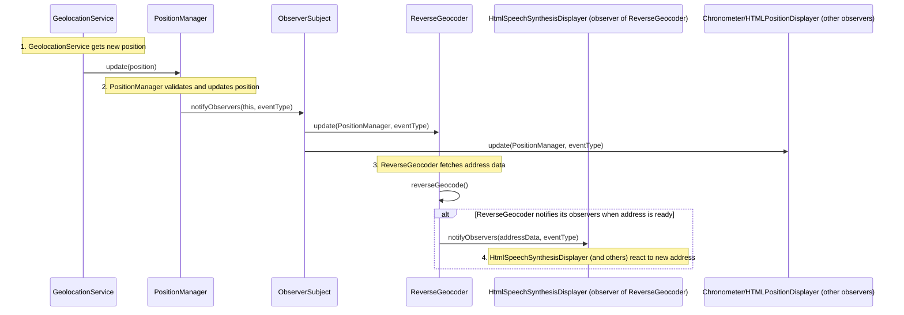
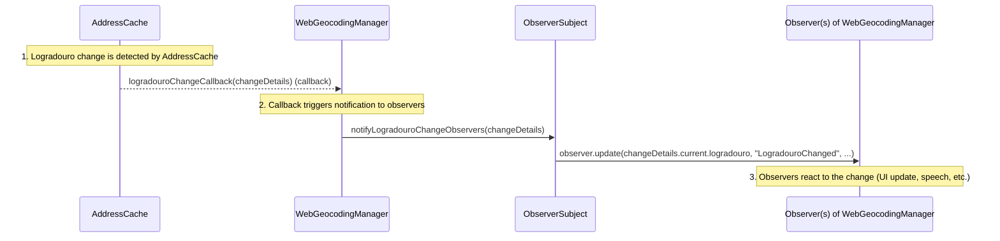

# Observer Pattern Execution Flow in `src/guia.js`

This document describes the execution flow of the Observer pattern as implemented in `guia.js`, focusing on the position update process and advanced callback-observer combinations.

## Key Components

- **Subject:** `PositionManager` (through its `ObserverSubject` composition)
- **Observers:** Any object with an `update()` method (e.g., `ReverseGeocoder`, `HTMLPositionDisplayer`, `Chronometer`, etc.)
- **Event:** Position update

---

## Sequence Diagram: Simple Position Update Flow

---

## Combined Callback and Observer Pattern Execution Flow

This diagram illustrates how a change in logradouro (street) is detected and propagated using both a callback mechanism and the observer-subject pattern.

### Flow Steps

1. **AddressCache** detects a logradouro change and triggers the registered callback (provided by `WebGeocodingManager`).
2. **WebGeocodingManager**'s callback handler (`handleLogradouroChange`) is called, which in turn notifies its own observers using the observer pattern.
3. **Observers** of `WebGeocodingManager` are notified and react accordingly (e.g., update UI, speak address).

---

This flow is more flexible than a pure observer pattern or pure callback approach, as it allows decoupling:
- The source of change detection (`AddressCache`)
- The central manager (`WebGeocodingManager`)
- The final UI or logic observers

---

## Example Observers in `guia.js`

- `ReverseGeocoder`: Receives new positions and fetches the address.
- `HtmlSpeechSynthesisDisplayer`: Notified by `ReverseGeocoder` when address data updates.
- `Chronometer`: Resets timer on position updates.
- UI classes: Update HTML views with current location or address.

## References

- See classes: `ObserverSubject`, `PositionManager`, and the `subscribe`, `notifyObservers`, `update` methods in [`/src/guia.js`](https://github.com/mpbarbosa/guia_js/blob/main/src/guia.js).