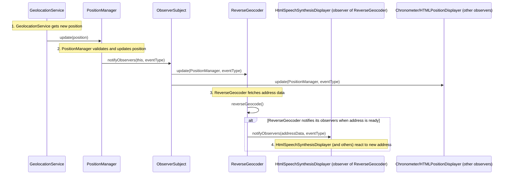

# Observer Pattern Execution Flow in `src/guia.js`

This document describes the execution flow of the Observer pattern as implemented in `guia.js`, focusing on the position update process.

## Key Components

- **Subject:** `PositionManager` (through its `ObserverSubject` composition)
- **Observers:** Any object with an `update()` method (e.g., `ReverseGeocoder`, `HTMLPositionDisplayer`, `Chronometer`, etc.)
- **Event:** Position update

## Sequence Diagram

## Flow Description

1. **GeolocationService** obtains a new position (e.g., from the browser API).
2. It calls `PositionManager.update(position)`.
3. `PositionManager` validates the position (accuracy, distance, time).
4. If valid, it calls `ObserverSubject.notifyObservers(this, eventType)`.
5. `ObserverSubject` iterates through all subscribed observers, calling their `update()` method.
6. `ReverseGeocoder`, as an observer, fetches address data and notifies its own observers (such as `HtmlSpeechSynthesisDisplayer`) when ready.
7. Each observer (such as `ReverseGeocoder`, `Chronometer`, UI components, or `HtmlSpeechSynthesisDisplayer`) reacts to the update.

## Example Observers in `guia.js`

- `ReverseGeocoder`: Receives new positions and fetches the address.
- `HtmlSpeechSynthesisDisplayer`: Notified by `ReverseGeocoder` when address data updates.
- `Chronometer`: Resets timer on position updates.
- UI classes: Update HTML views with current location or address.

## References

- See classes: `ObserverSubject`, `PositionManager`, and the `subscribe`, `notifyObservers`, `update` methods in [`/src/guia.js`](https://github.com/mpbarbosa/guia_js/blob/main/src/guia.js).